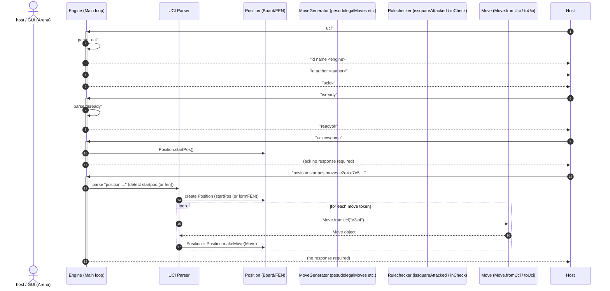

# ChessGPT4
Chess AI for ECE4318 Project

```mermaid
sequenceDiagram
    autonumber
    actor host as host / GUI (Arena)
    participant Engine as Engine (Main loop)
    participant Parser as UCI Parser
    participant Position as Position (Board/FEN)
    participant MoveGen as MoveGenerator (pesudolegalMoves etc.)
    participant Rule as Rulechecker (issquareAttacked / inCheck)
    participant MoveObj as Move (Move.fromUci / toUci)

    Host ->> Engine: "uci"
    activate Engine
    Engine ->> Engine: parse "uci"
    Engine -->> Host: "id name <engine>"
    Engine -->> Host: "id author <author>"
    Engine -->> Host: "uciok"
    deactivate Engine
    
    Host ->> Engine: "isready"
    activate Engine
    Engine ->> Engine: parse "isready"
    Engine -->> Host: "readyok"
    deactivate Engine
    
    Host ->> Engine: "ucinewgame"
    activate Engine
    Engine ->> Position: Position.startPos()
    Engine -->> Host: (ack no response required)
    deactivate Engine
    
    Host ->> Engine: "position startpos moves e2e4 e7e5 ..."
    activate Engine
    Engine ->> Parser: parse "position ..." (detect startpos (or fen))
    Parser ->> Position: create Position (startPos (or formFEN))
    loop for each move token
        Parser ->> MoveObj: Move.fromUci("e2e4")
        MoveObj -->> Parser: Move object
        Parser ->> Position: Position = Position.makeMove(Move)
    end
    Engine -->> Host: (no response required)
    deactivate Engine


```
