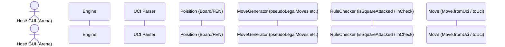

# ChessGPT4
Chess AI for ECE4318 Project

Demo in classPT2

```mermaid
sequenceDiagram
    autonumber
    actor Host as Host/ GUI (Arena)
    participant Engine as Engine
    participant Parser as UCI Parser
    participant Position as Poisition (Board/FEN)
    participant MoveGen as MoveGenerator (pseudoLegalMoves etc.)
    participant Rule as RuleChecker (isSquareAttacked / inCheck)
    participant MoveObj as Move (Move.fromUci / toUci)


```
