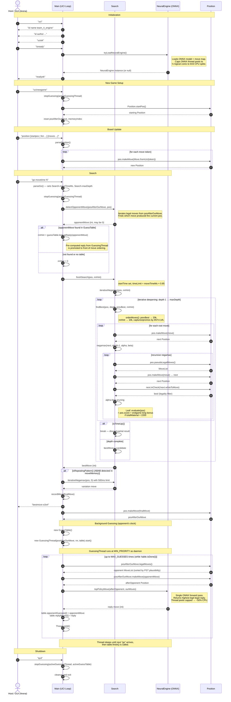

```mermaid
sequenceDiagram
    autonumber

    actor Host as Host / GUI (Arena)
    participant Main as Main (UCI Loop)
    participant Search as Search
    participant NN as NeuralEngine (ONNX)
    participant Position as Position

    %% ── Initialization ──────────────────────────────────────────────────────
    Note over Host, Position: Initialization

    Host ->> Main: "uci"
    Main -->> Host: "id name team_4_engine"
    Main -->> Host: "id author ..."
    Main -->> Host: "uciok"

    Host ->> Main: "isready"
    Main ->> NN: tryLoadNeuralEngine()
    Note right of NN: Loads ONNX model + move map.<br/>Caps ONNX thread pools to<br/>½ logical cores to limit CPU spike.
    NN -->> Main: NeuralEngine instance (or null)
    Main -->> Host: "readyok"

    %% ── New Game ────────────────────────────────────────────────────────────
    Note over Host, Position: New Game Setup

    Host ->> Main: "ucinewgame"
    Main ->> Main: stopGuessing(activeGuessingThread)
    Main ->> Position: Position.startPos()
    Position -->> Main: starting Position
    Main ->> Main: reset posAfterOurMove, memoryIndex

    %% ── Position Update ─────────────────────────────────────────────────────
    Note over Host, Position: Board Update

    Host ->> Main: "position [startpos | fen ...] [moves ...]"
    Main ->> Main: parsePosition()
    loop for each move token
        Main ->> Position: pos.makeMove(Move.fromUci(token))
        Position -->> Main: new Position
    end

    %% ── Go / Search ─────────────────────────────────────────────────────────
    Note over Host, NN: Search

    Host ->> Main: "go movetime N"
    Main ->> Main: parseGo() — sets Search.moveTimeMs, Search.maxDepth
    Main ->> Main: stopGuessing(activeGuessingThread)

    Main ->> Search: detectOpponentMove(posAfterOurMove, pos)
    Note right of Search: Iterates legal moves from posAfterOurMove.<br/>Finds which move produced the current pos.
    Search -->> Main: opponentMove (int, may be 0)

    alt opponentMove found in GuessTable
        Main ->> Main: nnHint = guessTable.lookupReply(opponentMove)
        Note right of Main: Pre-computed reply from GuessingThread<br/>is promoted to front of move ordering.
    else not found or no table
        Main ->> Main: nnHint = 0
    end

    Main ->> Search: freshSearch(pos, nnHint)
    Note right of Search: startTime set, timeLimit = moveTimeMs × 0.85

    Search ->> Search: iterativeNegamax(pos, nnHint)

    loop iterative deepening: depth 1 → maxDepth
        Search ->> Search: findBest(pos, depth, prevBest, nnHint)
        Note right of Search: orderMoves(): prevBest → 20k,<br/>nnHint → 10k, captures/promos by MVV-LVA.

        loop for each root move
            Search ->> Position: pos.makeMove(move)
            Position -->> Search: next Position
            Search ->> Search: negamax(next, depth-1, alpha, beta)

            loop recursive negamax
                Search ->> Position: pos.pseudoLegalMoves()
                Position -->> Search: MoveList
                Search ->> Position: pos.makeMove(move) → next
                Position -->> Search: next Position
                Search ->> Position: next.inCheck(!next.whiteToMove)
                Position -->> Search: bool (legality filter)
                Search ->> Search: alpha-beta pruning
                Note right of Search: Leaf: evaluate(pos)<br/>= pos.score + endgame king bonus<br/>if totalMaterial < 2200
            end
        end

        alt isTimeUp()
            Search ->> Search: break — discard partial result
        else depth complete
            Search ->> Search: bestMove = candidate
        end
    end

    Search -->> Main: bestMove (int)

    alt isRepeatingPattern() (ABAB detected in moveMemory)
        Main ->> Search: iterativeNegamax(pos, 0) with 500ms limit
        Search -->> Main: variation move
    end

    Main ->> Main: recordMove(finalMove)
    Main -->> Host: "bestmove e2e4"
    Main ->> Position: pos.makeMove(finalMove)
    Position -->> Main: posAfterOurMove

    %% ── Background Guessing ─────────────────────────────────────────────────
    Note over Main, NN: Background Guessing (opponent's clock)

    Main ->> Main: new GuessTable()
    Main ->> Main: new GuessingThread(posAfterOurMove, nn, table).start()

    Note over Main, NN: GuessingThread runs at MIN_PRIORITY as daemon

    loop up to MAX_GUESSES times (while !table.isDone())
        Main ->> Position: posAfterOurMove.legalMoves()
        Position -->> Main: opponent MoveList (sorted by PST plausibility)
        Main ->> Position: posAfterOurMove.makeMove(opponentMove)
        Position -->> Main: afterOpponent Position
        Main ->> NN: topPolicyMove(afterOpponent, ourMoves)
        Note right of NN: Single ONNX forward pass.<br/>Returns highest-logit legal reply.<br/>Thread pools capped → ~50% CPU.
        NN -->> Main: reply move (int)
        Main ->> Main: table.opponentGuesses[i] = opponentMove<br/>table.replyMoves[i] = reply
        Main ->> Main: Thread.yield()
    end

    Note over Main, NN: Thread sleeps until next "go" arrives,<br/>then table.finish() is called.

    %% ── Shutdown ────────────────────────────────────────────────────────────
    Note over Host, Main: Shutdown

    Host ->> Main: "quit"
    Main ->> Main: stopGuessing(activeGuessingThread, activeGuessTable)
    Main ->> Main: cleanup and exit
```
