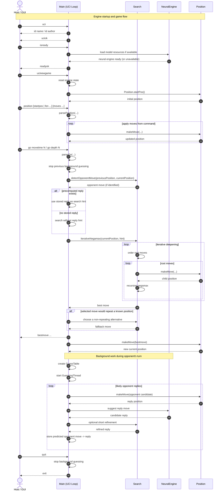

```mermaid
sequenceDiagram
    autonumber

    actor Host as Host / GUI
    participant Main as Main (UCI Loop)
    participant Search as Search
    participant NN as NeuralEngine
    participant Position as Position

    Note over Host, Position: Engine startup and game flow

    Host ->> Main: uci
    Main -->> Host: id name / id author
    Main -->> Host: uciok

    Host ->> Main: isready
    Main ->> NN: load model resources if available
    NN -->> Main: neural engine ready (or unavailable)
    Main -->> Host: readyok

    Host ->> Main: ucinewgame
    Main ->> Main: reset engine state
    Main ->> Position: Position.startPos()
    Position -->> Main: initial position

    Host ->> Main: position [startpos | fen ...] [moves ...]
    Main ->> Main: parsePosition(...)
    loop apply moves from command
        Main ->> Position: makeMove(...)
        Position -->> Main: updated position
    end

    Host ->> Main: go movetime N / go depth N
    Main ->> Main: parseGo(...)
    Main ->> Main: stop previous background guessing

    Main ->> Search: detectOpponentMove(previousPosition, currentPosition)
    Search -->> Main: opponent move (if identified)

    alt precomputed reply exists
        Main ->> Main: use stored reply as search hint
    else no stored reply
        Main ->> Main: search without reply hint
    end

    Main ->> Search: iterativeNegamax(currentPosition, hint)

    loop iterative deepening
        Search ->> Search: order root moves
        loop root moves
            Search ->> Position: makeMove(...)
            Position -->> Search: child position
            Search ->> Search: recursive negamax
        end
    end

    Search -->> Main: best move

    alt selected move would repeat a known position
        Main ->> Search: choose a non-repeating alternative
        Search -->> Main: fallback move
    end

    Main -->> Host: bestmove ...
    Main ->> Position: makeMove(bestmove)
    Position -->> Main: new current position

    Note over Main, NN: Background work during opponent's turn

    Main ->> Main: create GuessTable
    Main ->> Main: start GuessingThread

    loop likely opponent replies
        Main ->> Position: makeMove(opponent candidate)
        Position -->> Main: reply position
        Main ->> NN: suggest reply move
        NN -->> Main: candidate reply
        Main ->> Search: optional short refinement
        Search -->> Main: refined reply
        Main ->> Main: store predicted opponent move -> reply
    end

    Host ->> Main: quit
    Main ->> Main: stop background guessing
    Main -->> Host: exit
```
