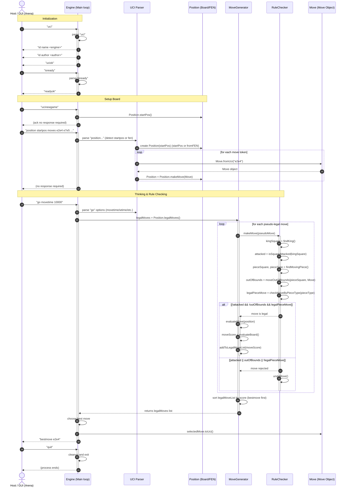

```mermaid

sequenceDiagram
    autonumber
    
    %% Define Actors and Participants
    actor Host as Host / GUI (Arena)
    participant Engine as Engine (Main loop)
    participant Parser as UCI Parser
    participant Position as Position (Board/FEN)
    participant MoveGen as MoveGenerator
    participant Rule as RuleChecker
    participant MoveObj as Move (Move Object)

    %% Initialization Phase
    Note over Host, Engine: Initialization
    Host ->> Engine: "uci"
    activate Engine
    Engine ->> Engine: parse "uci"
    Engine -->> Host: "id name <engine>"
    Engine -->> Host: "id author <author>"
    Engine -->> Host: "uciok"
    deactivate Engine

    Host ->> Engine: "isready"
    activate Engine
    Engine ->> Engine: parse "isready"
    Engine -->> Host: "readyok"
    deactivate Engine

    %% New Game and Position Setup
    Note over Host, Position: Setup Board
    Host ->> Engine: "ucinewgame"
    activate Engine
    Engine ->> Position: Position.startPos()
    Engine -->> Host: (ack no response required)
    deactivate Engine

    Host ->> Engine: "position startpos moves e2e4 e7e5 ..."
    activate Engine
    Engine ->> Parser: parse "position..." (detect startpos or fen)
    Parser ->> Position: create Position(startPos) (startPos or fromFEN)
    
    loop for each move token
        Parser ->> MoveObj: Move.fromUci("e2e4")
        MoveObj -->> Parser: Move object
        Parser ->> Position: Position = Position.makeMove(Move)
    end
    Engine -->> Host: (no response required)
    deactivate Engine


    %% Move Generation with Rule Checker Logic
    Note over Host, Rule: Thinking & Rule Checking
    Host ->> Engine: "go movetime 10000"
    activate Engine
    Engine ->> Parser: parse "go" options (movetime/wtime/etc.)
    Engine ->> MoveGen: legalMoves = Position.legalMoves()
    activate MoveGen

    loop for each pseudo-legal move
        MoveGen ->> Rule: makeMove(pseudoMove)
        activate Rule

        Rule ->> Rule: kingSquare = findKing()
        Rule ->> Rule: attacked = isSquareAttacked(kingSquare)
        Rule ->> Rule: pieceSquare, pieceType = findMovingPiece()
        Rule ->> Rule: outOfBounds = moveOutOfBounds(pieceSquare, Move)
        Rule ->> Rule: legalPieceMove = checkMoveByPieceType(pieceType)

        alt [!attacked && !outOfBounds && legalPieceMove]
            Rule -->> MoveGen: move is legal
            activate MoveGen
            MoveGen ->> MoveGen: evaluateMove(position)
            MoveGen ->> MoveGen: moveScore = evaluateBoard()
            MoveGen ->> MoveGen: addToLegalMoveList(moveScore)
            deactivate MoveGen
        else [attacked || outOfBounds || !legalPieceMove]
            Rule -->> MoveGen: move rejected
            Rule ->> Rule: undoMove()
        end

        deactivate Rule
    end

    MoveGen ->> MoveGen: sort legalMoveList by score (bestmove first)
    MoveGen -->> Engine: returns legalMoves list
    deactivate MoveGen


%% Selecting and Sending Move
    Engine ->> Engine: choose best move
    Engine ->> MoveObj: selectedMove.toUci()
    Engine -->> Host: "bestmove e2e4"
    deactivate Engine

    %% Shutdown
    Host ->> Engine: "quit"
    activate Engine
    Engine ->> Engine: cleanup and exit
    Engine -->> Host: (process ends)
    deactivate Engine
```
