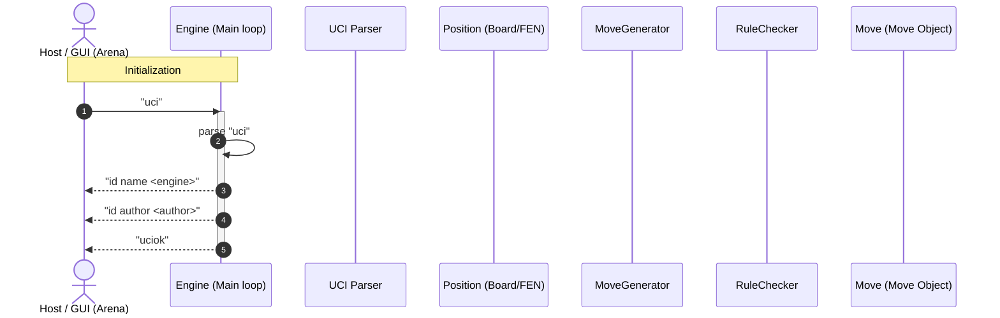

```mermaid

sequenceDiagram
    autonumber
    
    %% Define Actors and Participants
    actor Host as Host / GUI (Arena)
    participant Engine as Engine (Main loop)
    participant Parser as UCI Parser
    participant Position as Position (Board/FEN)
    participant MoveGen as MoveGenerator
    participant Rule as RuleChecker
    participant MoveObj as Move (Move Object)

    %% Initialization Phase
    Note over Host, Engine: Initialization
    Host ->> Engine: "uci"
    activate Engine
    Engine ->> Engine: parse "uci"
    Engine -->> Host: "id name <engine>"
    Engine -->> Host: "id author <author>"
    Engine -->> Host: "uciok"
    deactivate Engine

     
```